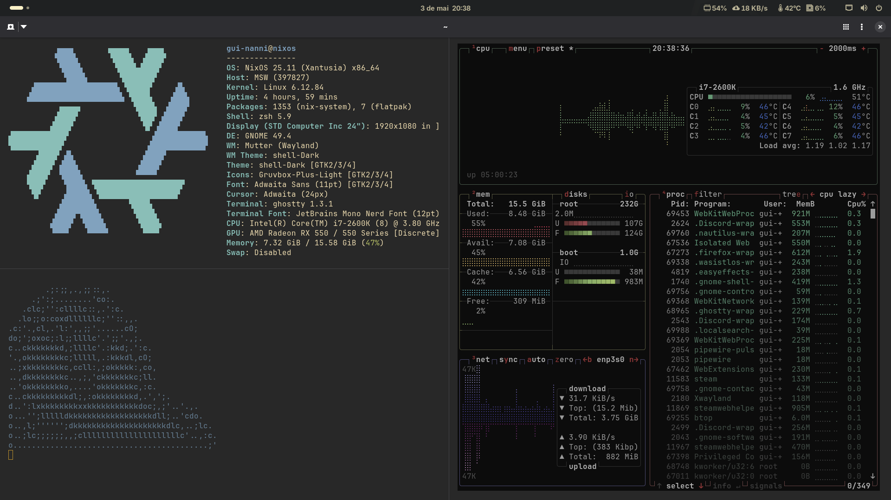

# NixOS config

## preview

<p align="center">
  
</p>

---

## instalar

```bash
git clone https://github.com/guilhermenanni/nixos.git
cd SEU-REPO
chmod +x install.sh
./install.sh

nixos (manual)
sudo cp configurations/nixos-system-configuration/* /etc/nixos/
sudo nixos-rebuild switch